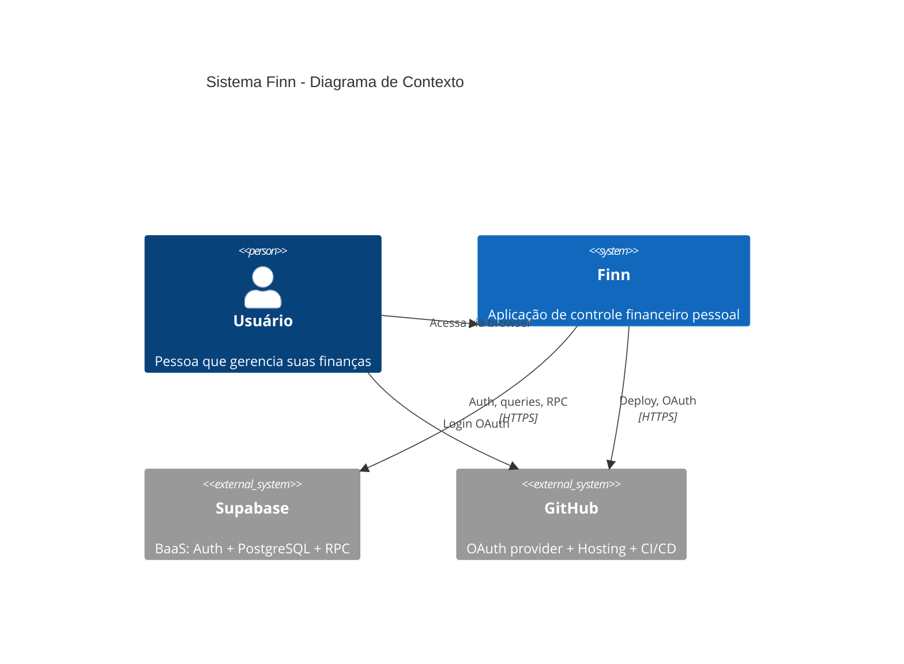
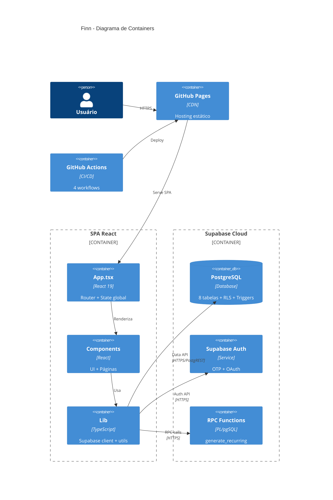
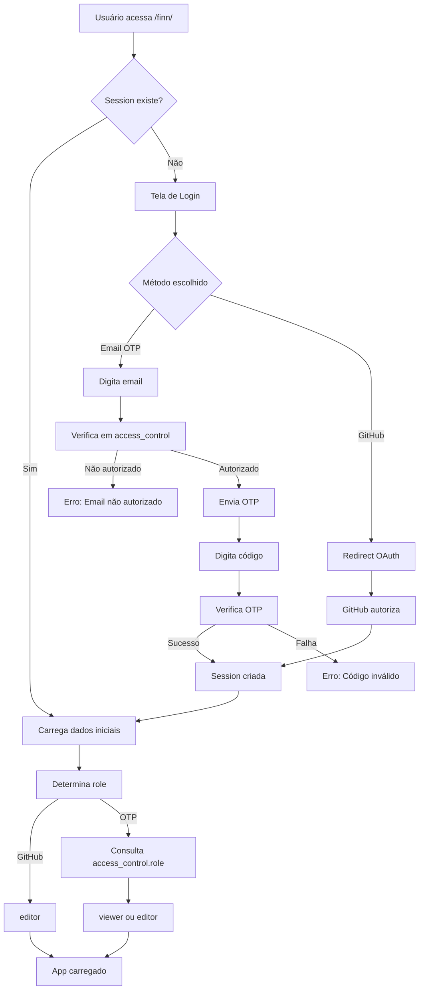
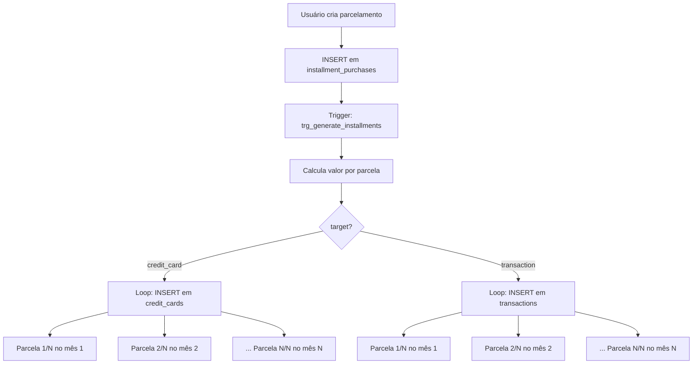
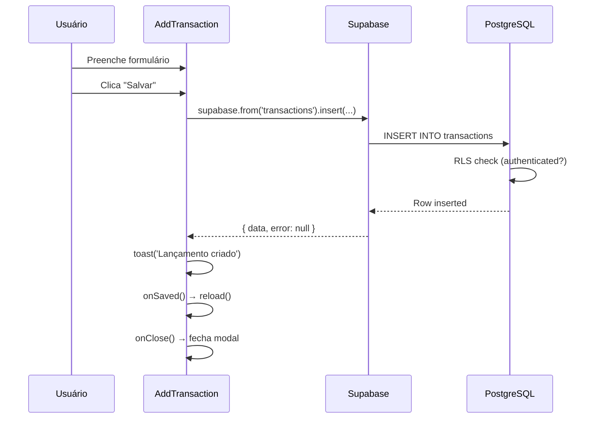
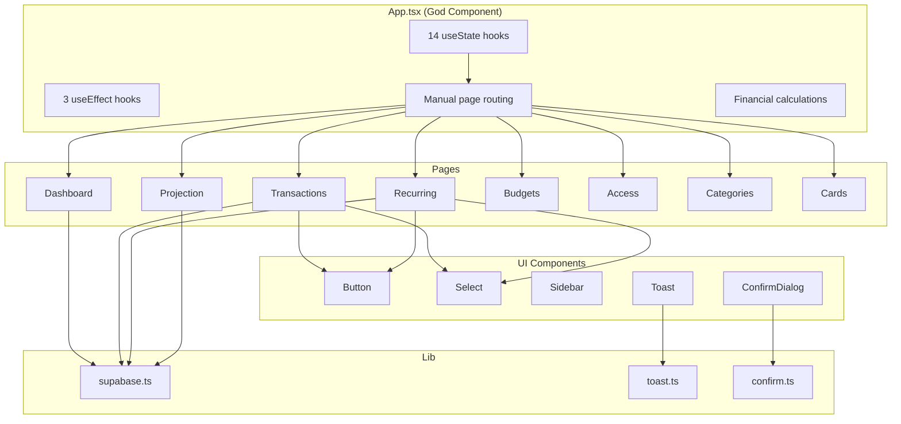
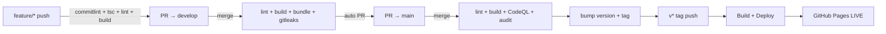

# 📋 Análise Técnica Completa — Finn

> **Data:** 2026-05-25  
> **Versão analisada:** 0.0.1  
> **Autor da análise:** Staff Engineer / Software Architect  

---

## ETAPA 1 — DESCOBERTA DO PROJETO

### Identificação

| Aspecto | Detalhe |
|---------|---------|
| **Tipo** | SPA (Single Page Application) — Frontend-only |
| **Domínio** | Controle financeiro pessoal/familiar |
| **Estilo arquitetural** | Monolito frontend com BaaS (Backend-as-a-Service) |
| **Linguagem** | TypeScript 6.0 |
| **Framework** | React 19.2 |
| **Build tool** | Vite 8.0 |
| **Package manager** | npm (lockfile v3) |
| **Backend** | Supabase (PostgreSQL + Auth + RLS + RPC) |
| **Deploy** | GitHub Pages (static hosting) |
| **CI/CD** | GitHub Actions (4 workflows) |
| **Node.js** | ≥ 24 |

### Stack Tecnológica Detalhada

| Camada | Tecnologia | Versão |
|--------|-----------|--------|
| UI Framework | React | 19.2.6 |
| Linguagem | TypeScript | ~6.0.2 |
| Bundler | Vite | ^8.0.12 |
| BaaS | Supabase JS | ^2.106.1 |
| Linting | ESLint | ^10.3.0 |
| Commit | Commitizen + Commitlint | 4.3.1 / 21.0.1 |
| Versioning | commit-and-tag-version | 12.7.3 |
| Git hooks | Husky | 9.1.7 |
| Pre-commit | lint-staged | 17.0.5 |

### Estrutura de Diretórios

```
finn/
├── .github/workflows/     # 4 pipelines CI/CD
├── .husky/                # Git hooks (commit-msg, pre-commit)
├── dist/                  # Build de produção
├── migrations/            # 8 SQL migrations (Supabase)
├── public/                # Assets estáticos (favicon, icons)
├── src/
│   ├── components/        # 10 subdiretórios de componentes
│   │   ├── access/        # Controle de acesso
│   │   ├── auth/          # Autenticação
│   │   ├── budgets/       # Orçamentos
│   │   ├── cards/         # Cartões de crédito
│   │   ├── categories/    # Categorias
│   │   ├── dashboard/     # Dashboard + SummaryCards
│   │   ├── projection/    # Projeção futura
│   │   ├── recurring/     # Templates recorrentes
│   │   ├── transactions/  # Tabelas + formulário
│   │   └── ui/            # Componentes reutilizáveis
│   ├── lib/               # Supabase client + utilitários
│   ├── types/             # Tipagem do banco
│   ├── App.tsx            # Componente raiz (router + state)
│   ├── App.css            # Estilos globais
│   ├── main.tsx           # Entry point
│   └── index.css          # Reset CSS
├── package.json
├── vite.config.ts
├── tsconfig.json
├── eslint.config.js
├── commitlint.config.js
└── ROADMAP.md
```

### Banco de Dados (Supabase/PostgreSQL)

| Tabela | Propósito | RLS |
|--------|-----------|-----|
| `categories` | Categorias de lançamentos | ✅ |
| `transactions` | Receitas e despesas | ✅ |
| `credit_cards` | Lançamentos de cartão | ✅ |
| `installment_purchases` | Compras parceladas (trigger) | ✅ |
| `recurring_templates` | Templates recorrentes | ✅ |
| `budgets` | Orçamento por categoria | ✅ |
| `access_control` | Controle de acesso (email+role) | ✅ |
| `cards` | Cartões cadastrados | ✅ |

### Integrações Externas

| Serviço | Uso |
|---------|-----|
| Supabase Auth | OTP por email + OAuth GitHub |
| Supabase Database | PostgreSQL gerenciado |
| Supabase RPC | Função `generate_recurring` |
| GitHub Pages | Hosting estático |
| GitHub Actions | CI/CD |
| CodeQL | SAST (análise estática de segurança) |
| Gitleaks | Detecção de secrets no código |

---

## ETAPA 2 — ARQUITETURA

### Visão Geral da Arquitetura

O Finn segue um padrão **SPA + BaaS** onde:
- O frontend React é a única camada de aplicação
- O Supabase atua como backend completo (auth, database, RPC)
- Não existe servidor intermediário (API própria)
- A segurança é delegada ao RLS (Row Level Security) do PostgreSQL

### Camadas Identificadas

```
┌─────────────────────────────────────────────┐
│              APRESENTAÇÃO (React)            │
│  App.tsx → Components → UI Components       │
├─────────────────────────────────────────────┤
│              ESTADO (useState local)         │
│  Sem state management externo               │
├─────────────────────────────────────────────┤
│              ACESSO A DADOS (direto)         │
│  supabase.from('table').select/insert/...   │
├─────────────────────────────────────────────┤
│              INFRAESTRUTURA (Supabase)       │
│  Auth + PostgreSQL + RLS + RPC + Triggers   │
└─────────────────────────────────────────────┘
```

### Análise de Acoplamento

**Alto acoplamento identificado:**
- Componentes acessam `supabase` diretamente (sem camada de serviço)
- `App.tsx` concentra estado global, lógica de negócio e roteamento
- Lógica de data (cálculo de meses, filtros) misturada com UI

**Coesão:**
- Componentes de página são coesos (cada um gerencia seu domínio)
- Componentes UI (`Button`, `Select`, `Toast`) são bem isolados
- `lib/` contém utilitários bem definidos (toast, confirm, supabase)

### Modularização

| Módulo | Responsabilidade | Coesão |
|--------|-----------------|--------|
| `auth/` | Login OTP + GitHub | Alta |
| `dashboard/` | Gráficos + resumos | Alta |
| `transactions/` | CRUD de lançamentos | Alta |
| `recurring/` | Templates recorrentes | Alta |
| `projection/` | Projeção futura | Alta |
| `budgets/` | Orçamentos | Alta |
| `categories/` | CRUD categorias | Alta |
| `cards/` | CRUD cartões | Alta |
| `access/` | Controle de acesso | Alta |
| `ui/` | Componentes reutilizáveis | Alta |
| `App.tsx` | Router + State + Layout | **Baixa** (God Component) |

### Escalabilidade

| Aspecto | Avaliação | Justificativa |
|---------|-----------|---------------|
| Horizontal | N/A | SPA estática, escala via CDN |
| Vertical (dados) | Limitada | Queries sem paginação |
| Funcional | Média | Adicionar features requer alterar App.tsx |
| Time | Baixa | Sem separação clara de domínios |

---

## ETAPA 3 — ENGENHARIA DE CÓDIGO

### Convenções Identificadas

| Aspecto | Padrão |
|---------|--------|
| Nomenclatura de arquivos | PascalCase para componentes |
| Nomenclatura de variáveis | camelCase |
| Exports | Default exports em componentes |
| CSS | Um arquivo CSS por componente (co-located) |
| Tipos | Centralizados em `types/database.ts` |
| Commits | Conventional Commits (enforced) |

### Padrões Positivos (Pontos Fortes)

1. **Tipagem completa do banco** — `Database` type com todas as 8 tabelas, incluindo `Insert`, `Update` e `Relationships`
2. **RLS consistente** — Todas as tabelas têm Row Level Security
3. **Triggers para lógica de negócio** — `generate_installments()` distribui parcelas automaticamente
4. **CI/CD progressivo** — Pipeline feature→develop→main→deploy com gates de qualidade
5. **Commit standards** — Commitlint + Commitizen + Husky enforçam padrão
6. **Bundle size check** — CI falha se JS > 512KB
7. **Security scanning** — CodeQL + Gitleaks + npm audit
8. **URL derivada do JWT** — Evita expor URL do Supabase como variável separada

### Anti-Patterns Identificados

#### 1. God Component (`App.tsx`)
```typescript
// App.tsx concentra:
// - 14 estados (useState)
// - 3 useEffects com lógica de negócio
// - Roteamento manual (switch por page state)
// - Cálculos financeiros (income, expense, cardTotal)
// - Lógica de autorização (isEditor, isOwner)
// - Função reload() com 5 queries
```
**Impacto:** Dificulta manutenção, testes e evolução.

#### 2. Acesso direto ao Supabase nos componentes
```typescript
// Em TransactionsTable.tsx:
const { error } = await supabase.from('transactions').update({ paid: !paid }).eq('id', id)

// Em Dashboard.tsx:
const { data } = await supabase.from('transactions').select('month, amount, type').order('month')
```
**Impacto:** Duplicação de queries, impossibilidade de cache, difícil de testar.

#### 3. Queries em loop (N+1 Problem)
```typescript
// Em Projection.tsx:
for (let i = 0; i < 6; i++) {
  const { data: cards } = await supabase.from('credit_cards').select('amount')...
  const { data: txInstall } = await supabase.from('transactions').select('amount')...
}
// 12 queries sequenciais para montar a projeção
```
**Impacto:** Performance degradada, latência multiplicada.

#### 4. Type assertions (`as never`)
```typescript
// Usado extensivamente para contornar tipagem:
await supabase.from('transactions').update({ paid: !paid } as never).eq('id', id)
await supabase.from('recurring_templates').insert({...} as never)
```
**Impacto:** Perde segurança de tipos, bugs silenciosos.

#### 5. Ausência total de testes
- Zero testes unitários
- Zero testes de integração
- Zero testes E2E
- Sem framework de testes configurado

#### 6. Lógica duplicada
```typescript
// Cálculo de nextMonth aparece 3x em App.tsx e Dashboard.tsx:
const nextMonth = m === 12 ? `${y + 1}-01-01` : `${y}-${String(m + 1).padStart(2, '0')}-01`

// fmt() definida em 4 arquivos diferentes:
const fmt = (v: number) => v.toLocaleString('pt-BR', { style: 'currency', currency: 'BRL' })
```

### SOLID Analysis

| Princípio | Conformidade | Observação |
|-----------|-------------|------------|
| **S** - Single Responsibility | ❌ | App.tsx viola gravemente |
| **O** - Open/Closed | ⚠️ | Adicionar página requer alterar App.tsx |
| **L** - Liskov Substitution | ✅ | N/A (sem herança) |
| **I** - Interface Segregation | ✅ | Props bem definidas |
| **D** - Dependency Inversion | ❌ | Componentes dependem diretamente do Supabase |

### Clean Code Analysis

| Aspecto | Nota | Observação |
|---------|------|------------|
| Legibilidade | 7/10 | Código claro, mas funções longas |
| Nomenclatura | 8/10 | Nomes descritivos |
| Funções pequenas | 5/10 | Muitas funções > 30 linhas |
| DRY | 4/10 | Muita duplicação (fmt, queries, cálculos) |
| KISS | 7/10 | Soluções simples, sem over-engineering |
| YAGNI | 9/10 | Sem abstrações desnecessárias |

---

## ETAPA 4 — FLUXOS CRÍTICOS

### Fluxo 1: Autenticação

```
1. Usuário acessa /finn/
2. App.tsx verifica session via supabase.auth.getSession()
3. Se não autenticado → renderiza <Auth />
4. Auth.tsx oferece:
   a) OTP por email:
      - Verifica email em access_control (RLS: select público)
      - Se autorizado → envia OTP via supabase.auth.signInWithOtp()
      - Usuário digita código → supabase.auth.verifyOtp()
   b) GitHub OAuth:
      - supabase.auth.signInWithOAuth({ provider: 'github' })
      - Redirect para GitHub → callback → session criada
5. onAuthStateChange() detecta nova session
6. App.tsx carrega dados iniciais (categories, cards, role)
7. Role determinada:
   - GitHub login → sempre 'editor'
   - OTP login → consulta access_control.role
```

### Fluxo 2: Lançamentos (CRUD)

```
1. Usuário navega para "Lançamentos" (page = 'transactions')
2. useEffect em App.tsx carrega transactions + credit_cards do mês
3. Filtros aplicados localmente (owner, search, type, category)
4. Criar:
   - Botão "+ Novo" → modal AddTransaction
   - Formulário com target (transaction/credit_card)
   - Insert direto no Supabase → reload() → atualiza estado
5. Editar (inline):
   - Clique em ✏️ → linha vira inputs editáveis
   - Salvar → update no Supabase → atualiza estado local
6. Excluir:
   - Clique em 🗑️ → confirm() → delete no Supabase
7. Marcar pago:
   - Toggle paid → update no Supabase → atualiza estado local
```

### Fluxo 3: Parcelamentos (Trigger automático)

```
1. Usuário insere em installment_purchases:
   - start_month, description, total_amount, installments, target
2. Trigger PostgreSQL `trg_generate_installments` dispara
3. Função `generate_installments()`:
   - Calcula valor por parcela (total / installments)
   - Loop de 1 até N parcelas
   - Se target = 'credit_card' → insere em credit_cards
   - Se target = 'transaction' → insere em transactions
   - Cada registro recebe current_installment e total_installments
4. Parcelas distribuídas automaticamente nos meses futuros
```

### Fluxo 4: Geração de Recorrentes

```
1. Usuário seleciona mês e clica "⚡ Gerar"
2. Frontend chama supabase.rpc('generate_recurring', { target_month })
3. Função PostgreSQL:
   - Itera sobre recurring_templates WHERE active = true
   - Para cada template:
     - Calcula data = target_month + (day - 1) dias
     - Verifica se já existe (idempotência por description+month+owner)
     - Se não existe → insere em transactions ou credit_cards
4. Frontend exibe toast de sucesso
```

### Fluxo 5: Dashboard

```
1. Carrega TODAS as transactions (sem filtro de mês) para evolução anual
2. Agrupa por mês → calcula income/expense por mês
3. Últimos 12 meses renderizados como gráfico SVG de linhas
4. Carrega budgets para comparação
5. Ao selecionar mês (clique no gráfico ou input):
   - Carrega transactions do mês selecionado
   - Calcula despesas por categoria (gráfico pizza CSS conic-gradient)
   - Calcula progresso de pagamento (paid/total)
   - Lista contas pendentes com alerta de atraso
```

---

## ETAPA 5 — RISCOS TÉCNICOS

### Classificação de Riscos

| # | Risco | Severidade | Impacto | Complexidade de Correção |
|---|-------|-----------|---------|--------------------------|
| 1 | Ausência total de testes | 🔴 Alta | Regressões silenciosas | Média |
| 2 | Sem Error Boundaries | 🔴 Alta | Tela branca em produção | Baixa |
| 3 | Queries N+1 em Projection | 🟡 Média | Performance degradada | Baixa |
| 4 | God Component (App.tsx) | 🟡 Média | Manutenibilidade | Média |
| 5 | Sem paginação de dados | 🟡 Média | Escala limitada | Média |
| 6 | `as never` type assertions | 🟡 Média | Bugs silenciosos | Baixa |
| 7 | Sem router (deep linking) | 🟡 Média | UX degradada | Baixa |
| 8 | RLS permissivo em access_control | 🟡 Média | Qualquer um vê emails | Baixa |
| 9 | Sem rate limiting no OTP | 🟡 Média | Brute force possível | Baixa (Supabase config) |
| 10 | CSS sem design system | 🟢 Baixa | Inconsistência visual | Alta |
| 11 | Sem loading states | 🟢 Baixa | UX degradada | Baixa |
| 12 | Sem acessibilidade | 🟢 Baixa | Exclusão de usuários | Média |

### Débitos Técnicos Detalhados

#### Crítico: Ausência de Testes
- **Risco:** Qualquer refatoração pode introduzir regressões não detectadas
- **Impacto:** Impossibilidade de refatorar com confiança
- **Mitigação atual:** CI faz apenas lint + build (não valida comportamento)

#### Alto: Segurança do access_control
```sql
-- A policy permite SELECT público (sem autenticação):
create policy "Anon check email" on access_control for select using (true);
```
- **Risco:** Qualquer pessoa pode listar todos os emails autorizados
- **Correção:** Restringir select para `auth.email() = email` ou usar função RPC

#### Médio: Performance da Projeção
- 12 queries sequenciais para 6 meses
- Cada query faz round-trip ao Supabase
- **Correção:** Criar RPC que retorna projeção agregada em uma única query

---

## ETAPA 6 — MELHORIAS RECOMENDADAS

### Quick Wins (1-2 dias cada)

| # | Melhoria | Impacto |
|---|----------|---------|
| 1 | Extrair `fmt()` e utilitários para `src/utils/format.ts` | DRY |
| 2 | Adicionar Error Boundary global | Resiliência |
| 3 | Criar RPC para projeção (eliminar N+1) | Performance |
| 4 | Corrigir RLS de `access_control` | Segurança |
| 5 | Adicionar loading skeletons | UX |
| 6 | Remover `as never` com tipagem correta | Type safety |

### Médio Prazo (1-2 semanas)

| # | Melhoria | Impacto |
|---|----------|---------|
| 1 | Extrair custom hooks (`useTransactions`, `useAuth`) | Manutenibilidade |
| 2 | Adicionar React Router | UX + Deep linking |
| 3 | Implementar camada de serviço (`services/`) | Testabilidade |
| 4 | Configurar Vitest + Testing Library | Qualidade |
| 5 | Implementar React Query/TanStack Query | Cache + retry |
| 6 | Decompor App.tsx em providers + router | SRP |

### Longo Prazo (1-3 meses)

| # | Melhoria | Impacto |
|---|----------|---------|
| 1 | Design system com CSS Modules ou Tailwind | Consistência |
| 2 | PWA com service worker | Mobile UX |
| 3 | Testes E2E com Playwright | Confiança |
| 4 | Supabase Edge Functions para notificações | Funcionalidade |
| 5 | Accessibility audit + correções (WCAG 2.1) | Inclusão |
| 6 | i18n com react-intl | Internacionalização |

---

# WIKI DO PROJETO

## VISÃO GERAL

### Objetivo do Sistema
Finn é uma aplicação de controle financeiro pessoal que permite gerenciar receitas, despesas, cartões de crédito, parcelamentos e projeções futuras. Suporta múltiplos responsáveis (pessoal + sogra) com controle de acesso baseado em roles.

### Contexto de Negócio
- Uso pessoal/familiar (não é SaaS multi-tenant)
- Foco em visibilidade financeira mensal
- Automação de lançamentos recorrentes
- Projeção de compromissos futuros

### Stack Tecnológica
React 19 + TypeScript 6 + Vite 8 + Supabase (PostgreSQL + Auth)

### Arquitetura Geral
SPA estática deployada em GitHub Pages, consumindo Supabase como BaaS. Sem servidor intermediário. Segurança via RLS no PostgreSQL.

---

## ESTRUTURA DO PROJETO

### Diretórios Principais

| Diretório | Responsabilidade |
|-----------|-----------------|
| `src/components/auth/` | Tela de login (OTP + GitHub) |
| `src/components/dashboard/` | Dashboard com gráficos e resumos |
| `src/components/transactions/` | CRUD de lançamentos + tabelas |
| `src/components/recurring/` | Templates de lançamentos recorrentes |
| `src/components/projection/` | Projeção dos próximos 6 meses |
| `src/components/budgets/` | Orçamentos por categoria |
| `src/components/categories/` | CRUD de categorias |
| `src/components/cards/` | CRUD de cartões de crédito |
| `src/components/access/` | Gerenciamento de acessos |
| `src/components/ui/` | Button, Select, Sidebar, Toast, ConfirmDialog |
| `src/lib/` | Supabase client, toast system, confirm dialog |
| `src/types/` | Tipagem completa do banco de dados |
| `migrations/` | 8 SQL migrations para Supabase |

---

## FLUXOS DO SISTEMA

### Autenticação
1. Email OTP: verifica autorização → envia código → verifica código
2. GitHub OAuth: redirect → callback → session automática
3. Role: GitHub = editor, OTP = consulta access_control

### Lançamentos
- CRUD completo com edição inline
- Filtros por mês, responsável, tipo, categoria, busca
- Marcar como pago/pendente

### Recorrentes
- Templates com dia de vencimento
- Geração automática via RPC PostgreSQL
- Idempotência (não duplica se já existe)

### Parcelamentos
- Trigger automático distribui parcelas nos meses
- Suporta cartão de crédito ou boleto/pix

### Projeção
- Soma recorrentes + parcelas futuras
- Visão de 6 meses à frente

---

## DOCUMENTAÇÃO TÉCNICA

### Banco de Dados

**Funções PostgreSQL:**
- `generate_installments()` — Trigger que distribui parcelas
- `generate_recurring(target_month)` — RPC que gera lançamentos do mês

**Triggers:**
- `trg_generate_installments` — After INSERT em installment_purchases

### Configurações

| Variável | Descrição |
|----------|-----------|
| `VITE_SUPABASE_ANON_KEY` | Chave anônima do Supabase (JWT) |

A URL do Supabase é extraída automaticamente do payload JWT (campo `ref`).

### Secrets (GitHub)

| Secret | Uso |
|--------|-----|
| `VITE_SUPABASE_ANON_KEY` | Build em CI |
| `PAT` | Push de tags + trigger de deploy |
| `GITHUB_TOKEN` | Criação de PRs automáticos |

---

## PADRÕES IDENTIFICADOS

### Design Patterns Utilizados
- **Observer Pattern** — Toast system com subscribe/publish
- **Compound Components** — Sidebar + Page navigation
- **Controlled Components** — Formulários React
- **Optimistic UI** — Update local antes de confirmar no servidor

### Anti-Patterns Detectados
- **God Component** — App.tsx com múltiplas responsabilidades
- **Prop Drilling** — Dados passados por 2-3 níveis
- **Direct Data Access** — Sem camada de abstração para o banco
- **Type Assertion Abuse** — `as never` para contornar tipagem

---

## SEGURANÇA

### Autenticação
- OTP por email (Supabase Auth)
- OAuth GitHub
- Whitelist de emails em access_control

### Autorização
- RLS em todas as tabelas (auth.role() = 'authenticated')
- Roles: viewer (somente leitura) / editor (CRUD)
- GitHub login = sempre editor (owner)
- UI condicional baseada em role

### Vulnerabilidades Identificadas
1. `access_control` com SELECT público (expõe emails)
2. Sem rate limiting explícito no OTP (depende do Supabase)
3. Anon key exposta no frontend (esperado, mas RLS deve ser robusto)

### Boas Práticas Aplicadas
- RLS em 100% das tabelas
- Secrets em GitHub Secrets (não no código)
- Gitleaks no CI para detecção de vazamentos
- CodeQL para análise estática de segurança
- `.env` no `.gitignore`

---

## ESCALABILIDADE

### Gargalos Atuais
1. Queries sem paginação (carrega todos os registros)
2. Dashboard carrega TODAS as transactions para gráfico anual
3. Projeção faz 12 queries sequenciais
4. Sem cache (cada navegação refaz queries)

### Estratégias de Scaling
- CDN para assets estáticos (GitHub Pages já faz)
- Supabase escala verticalmente (plano pode ser aumentado)
- Índices no PostgreSQL (implícitos via PKs e FKs)

### Melhorias Possíveis
- React Query para cache client-side
- Paginação com cursor-based pagination
- RPC agregada para dashboard (uma query)
- Materializar dados de projeção

---

## OBSERVABILIDADE

### Estado Atual
| Aspecto | Status |
|---------|--------|
| Logs estruturados | ❌ Não existe |
| Métricas | ❌ Não existe |
| Tracing | ❌ Não existe |
| Error tracking | ❌ Não existe |
| Alertas | ❌ Não existe |

### Recomendações
1. Sentry para error tracking (free tier)
2. Supabase Dashboard para métricas de banco
3. GitHub Actions logs para CI/CD
4. Web Vitals para performance frontend

---

## DEVOPS

### Pipeline CI/CD

```
feature/* push
  → commitlint + tsc + lint + build
  → auto-create PR → develop

develop merge
  → lint + build + bundle size check + gitleaks
  → auto-create PR → main

main merge
  → lint + build + CodeQL + npm audit
  → bump version + tag
  → trigger deploy

v* tag
  → build + deploy to GitHub Pages
```

### Build
- `npm run build` = `tsc -b && vite build`
- Output: `dist/` (JS + CSS + HTML)
- Bundle limit: 512KB JS

### Deploy
- GitHub Pages via `actions/deploy-pages@v4`
- Triggered por tags `v*`
- Environment: `github-pages`
- Concurrency: cancel-in-progress

---

## TESTES

### Estado Atual
- **Zero testes** de qualquer tipo
- Sem framework de testes configurado
- Sem coverage reports

### Estratégia Recomendada

| Tipo | Framework | Prioridade |
|------|-----------|-----------|
| Unitário | Vitest + Testing Library | Alta |
| Integração | Vitest + MSW (mock Supabase) | Média |
| E2E | Playwright | Baixa (após estabilizar) |

### Cobertura Mínima Sugerida
- Fluxo de autenticação
- CRUD de transações
- Cálculos financeiros (income, expense, totals)
- Geração de recorrentes
- Filtros e buscas

---

## DÉBITOS TÉCNICOS (Priorizado)

| # | Débito | Severidade | Esforço |
|---|--------|-----------|---------|
| 1 | Sem testes | 🔴 Crítico | 2-3 semanas |
| 2 | God Component App.tsx | 🔴 Alto | 1 semana |
| 3 | Sem Error Boundaries | 🟡 Médio | 2 horas |
| 4 | Queries N+1 em Projection | 🟡 Médio | 4 horas |
| 5 | `as never` type assertions | 🟡 Médio | 1 dia |
| 6 | Duplicação de código (fmt, queries) | 🟡 Médio | 1 dia |
| 7 | Sem camada de serviço | 🟡 Médio | 1 semana |
| 8 | Sem React Router | 🟡 Médio | 2 dias |
| 9 | RLS permissivo em access_control | 🟡 Médio | 1 hora |
| 10 | Sem loading states | 🟢 Baixo | 1 dia |
| 11 | Sem acessibilidade | 🟢 Baixo | 1 semana |
| 12 | Sem dark mode | 🟢 Baixo | 2 dias |

---

## ROADMAP SUGERIDO

### Curto Prazo (Sprint 1-2: 2 semanas)
1. ✅ Corrigir RLS de access_control
2. ✅ Adicionar Error Boundary global
3. ✅ Extrair utilitários duplicados para `src/utils/`
4. ✅ Criar RPC para projeção (eliminar N+1)
5. ✅ Remover `as never` com tipagem correta
6. ✅ Configurar Vitest + primeiros testes

### Médio Prazo (Sprint 3-6: 1 mês)
1. Decompor App.tsx (React Router + Context/Providers)
2. Criar camada de serviço (`src/services/`)
3. Implementar React Query para cache
4. Custom hooks (`useTransactions`, `useAuth`, etc.)
5. Loading skeletons em todas as páginas
6. Cobertura de testes > 60%

### Longo Prazo (2-3 meses)
1. PWA com offline support
2. Design system (CSS Modules ou Tailwind)
3. Testes E2E com Playwright
4. Accessibility audit (WCAG 2.1 AA)
5. Supabase Edge Functions para notificações
6. Exportação CSV/PDF
7. Dark/light mode
8. Responsivo mobile

---

# DIAGRAMAS

## Diagrama C4 — Nível 1 (Contexto)



**Explicação:** O usuário interage com o Finn via browser. O Finn se comunica diretamente com o Supabase para autenticação e dados. O GitHub serve como provedor OAuth e plataforma de hosting/CI.

## Diagrama C4 — Nível 2 (Containers)



**Explicação:** A SPA é servida pelo GitHub Pages. Internamente, App.tsx orquestra componentes que usam a lib para acessar Supabase. O banco tem RLS, triggers e funções RPC.

## Diagrama de Fluxo — Autenticação



**Explicação:** Dois caminhos de autenticação convergem para a criação de session. A role é determinada pelo provedor (GitHub = editor) ou pela tabela access_control.

## Diagrama de Fluxo — Parcelamentos



**Explicação:** O trigger PostgreSQL automatiza a distribuição de parcelas. Uma única inserção gera N registros nos meses futuros.

## Diagrama de Sequência — Criar Lançamento



**Explicação:** Fluxo síncrono simples. O RLS valida que o usuário está autenticado antes de permitir a inserção.

## Diagrama de Componentes



**Explicação:** App.tsx é o hub central que roteia para páginas. Cada página acessa Supabase diretamente e usa componentes UI compartilhados.

## Diagrama de Dependências

```mermaid
graph LR
    subgraph "External"
        REACT[React 19]
        SUPA_JS[@supabase/supabase-js]
        VITE[Vite 8]
    end

    subgraph "Dev Tools"
        TS[TypeScript 6]
        ESLINT[ESLint 10]
        HUSKY[Husky 9]
        COMMITLINT[Commitlint 21]
        LINT_STAGED[lint-staged 17]
        CZ[Commitizen]
        CTV[commit-and-tag-version]
    end

    subgraph "CI/CD"
        GHA[GitHub Actions]
        CODEQL[CodeQL]
        GITLEAKS[Gitleaks]
    end

    APP[Finn App] --> REACT
    APP --> SUPA_JS
    APP --> VITE

    APP -.-> TS
    APP -.-> ESLINT
    APP -.-> HUSKY
    HUSKY --> COMMITLINT
    HUSKY --> LINT_STAGED
    APP -.-> CZ
    APP -.-> CTV

    GHA --> CODEQL
    GHA --> GITLEAKS
```

**Explicação:** Apenas 3 dependências de produção (React, React DOM, Supabase JS). Tooling robusto de desenvolvimento com 10+ devDependencies focadas em qualidade.

## Diagrama de Deploy (Pipeline)



**Explicação:** Pipeline progressivo com 4 estágios. Cada merge adiciona verificações mais rigorosas. Deploy só ocorre após tag semântica.

---

## CONCLUSÃO

O Finn é um projeto bem concebido para seu escopo (controle financeiro pessoal), com decisões técnicas pragmáticas:
- **Supabase como BaaS** elimina a necessidade de backend próprio
- **GitHub Pages** oferece hosting gratuito e confiável
- **CI/CD progressivo** garante qualidade incremental
- **RLS** delega segurança ao banco de dados

Os principais pontos de evolução são:
1. **Testabilidade** — Prioridade máxima para permitir refatorações seguras
2. **Decomposição do App.tsx** — Necessária para escalar funcionalidades
3. **Camada de serviço** — Fundamental para cache, retry e testabilidade
4. **Performance** — RPC agregadas e React Query resolveriam os gargalos

O projeto demonstra maturidade em DevOps (CI/CD, security scanning, conventional commits) mas carece de maturidade em engenharia de software (testes, separação de concerns, observabilidade).
